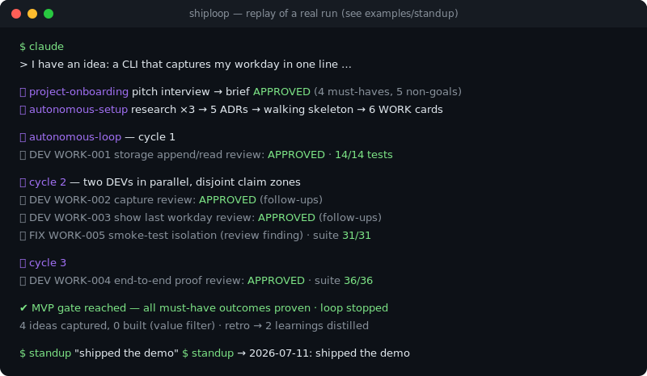

# claude-shiploop

[English](README.md) · **Deutsch**

[](https://github.com/BechsteinDigital/claude-shiploop/actions/workflows/ci.yml)
[](LICENSE)
[](https://ko-fi.com/bechsteindigital)

**Autonome Delivery-Skills für Claude Code — Idee pitchen, MVP bekommen.**
Projekt- und sprachunabhängige Skill-Suite: vom Idee-Pitch über autonomes Setup
bis zum parallelen, selbstkontrollierten Delivery-Loop — mit Verträgen, Gates und Evidenzregeln
statt Hoffnung.

<p align="center">
  
</p>

**End-to-End validiert, Artefakte inklusive:** Die Demo oben ist das Replay eines echten
Durchlaufs — Pitch → Interview → Setup → 3 Loop-Zyklen (2 DEVs parallel) → MVP-Gate
(`standup`-CLI, 36/36 Tests). Die unbearbeiteten Projekt-Artefakte liegen in
[`examples/standup`](examples/README.md), und die CI führt dessen Testsuite bei jedem Push aus.

## Ablauf

```
Pitch ──▶ project-onboarding ──▶ autonomous-setup ──▶ autonomous-loop ──▶ MVP-Report
          (einziger inter-        (Research, Stack,     (CEO→PO→DEV∥DEV→REVIEWER,
           aktiver Schritt)        Scaffold, Backlog)     Ideen-Trichter, Gates)
```

Du pitchst eine Idee und beantwortest einmal das Onboarding-Interview. Alles danach läuft
autonom: Die Suite recherchiert, wählt einen Stack, scaffoldet das Projekt, schneidet
Arbeitspakete und orchestriert Rollen-Agenten parallel bis zum MVP-Gate — eskaliert wird nur
über Kriterien, denen du explizit zugestimmt hast.

## Quickstart

**Als Plugin (empfohlen):** in Claude Code ausführen

```
/plugin marketplace add BechsteinDigital/claude-shiploop
/plugin install claude-shiploop@bechstein-digital
```

**Oder per Install-Skript:**

```bash
git clone https://github.com/BechsteinDigital/claude-shiploop.git
cd claude-shiploop
./install.sh /pfad/zum/projekt    # oder: ./install.sh --global
```

Danach die Claude-Code-Session **im Zielprojekt** starten und die Idee pitchen —
`project-onboarding` übernimmt ab dort.

## Skills

| Skill | Zweck |
|---|---|
| `project-onboarding` | Pitch-Interview bis Definition of Ready; erzeugt freigegebenen Brief inkl. Kernvertrag und Autonomievertrag |
| `autonomous-setup` | Bootstrapping ohne Rückfragen: Research, ADRs, Scaffold, Backlog |
| `autonomous-loop` | Orchestriert Rollen als (parallele) Subagenten bis MVP-Gate |
| `role-ceo` | Portfolio-Entscheidungen, Gates, WIP, Anti-Thrash |
| `role-po` | Paket-Zuschnitt, Akzeptanzkriterien, Claim-Zonen, **Ideen-Triage (Wertfilter)** |
| `role-dev` | Implementiert genau ein Paket, silent, Evidenz-Output |
| `role-reviewer` | Delta-Review: Akzeptanz, Claim-Audit, Zonen-Check |
| `role-auditor` | Zustands-Audit per parallelem read-only Fan-out |

## Warum das hier und keine lose Skill-Sammlung?

Die meisten Skill-Sammlungen sind Werkzeugkisten — fahren musst du selbst. Diese Suite ist ein
Betriebsmodell:

- **Autonomie mit Vertrag:** Eskalation an den User nur über explizit vereinbarte Kriterien;
  alles andere wird entschieden und geloggt.
- **Fokus als Mechanik, nicht als Appell:** Wertfilter, Cooling-off, Ideen-Ketten-Regel,
  Erweiterungsbudget — Verbote allein halten keinen autonomen Loop auf Kurs.
- **Claims brauchen Evidenz:** Doku darf nie mehr behaupten als Code + Tests belegen.
- **Parallelität über Claim-Zonen:** disjunkte Dateizonen je Paket; bei Unsicherheit
  Worktree-Isolation.

## Projekt-Artefakte (im Zielprojekt, von den Skills erzeugt)

```
project/
  BRIEF.md        Produktbrief + Kernvertrag + Autonomievertrag (Verfassung)
  PROFILE.md      Stack, verifizierte Kommandos, Qualitätsregeln (einzige Kommando-Quelle)
  STATE.md        einziger Zustandsspeicher (WIP, Milestone, Budget, Zyklus)
  DECISIONS.md    ADR-light-Log autonomer Entscheidungen
  IDEAS.md        Ideen-Trichter mit Triage-Regeln
  LEARNINGS.md    Retro-Destillat dieses Projekts (Gate-Pflicht)
  backlog/        WORK-Karten (inkl. Claim-Zone + Komplexität)
  log/            Research-, Audit-, Zyklus-Logs
```

## Design-Prinzipien

1. **Eine Quelle pro Wahrheit:** Kommandos nur in `PROFILE.md`, Zustand nur in `STATE.md` —
   keine Snapshot-Duplikate, die driften.
2. **Fokus als Mechanik, nicht als Appell:** Wertfilter, Cooling-off, Ideen-Ketten-Regel,
   Erweiterungsbudget — Verbote allein halten keinen autonomen Loop auf Kurs.
3. **Autonomie mit Vertrag:** Eskalation an den User nur über explizit vereinbarte Kriterien;
   alles andere wird entschieden und geloggt.
4. **Parallelität über Claim-Zonen:** disjunkte Dateizonen je Paket; bei Unsicherheit
   Worktree-Isolation.
5. **Claims brauchen Evidenz:** Doku darf nie mehr behaupten als Code + Tests belegen.
6. **Modell-Hierarchie:** Teure Tokens dorthin, wo geurteilt wird (Orchestrator, PO-Schnitt,
   Gate-Reviews); günstige dorthin, wo ausgeführt wird (DEV/Review nach Karten-Komplexität,
   Auditor-Fan-out). Die Kartenqualität macht kleine Modelle sicher — deshalb wird am PO nie
   gespart.
7. **Erfahrungswissen als Destillat:** Retro am Milestone-Gate → max. 3–5 Learnings nach
   `project/LEARNINGS.md`, Generalisierbares in die globale KB `_shared/knowledge/` (nur am
   Master-Ort, wird nicht mitinstalliert). Setup und Reviews lesen sie — jedes Projekt startet
   mit der Erfahrung aller vorherigen.

## Installations-Details

```bash
./install.sh /pfad/zum/projekt    # kopiert Skills + _shared/ nach <projekt>/.claude/skills/
./install.sh --global             # installiert nach ~/.claude/skills/ für alle Projekte
```

Die Skills referenzieren die Skripte in `_shared/scripts/` relativ zum Installationsort —
beide Varianten funktionieren.

Die globale Wissensbasis bleibt in diesem Repo (eine Quelle, wird nie in Projekte installiert).
`install.sh` schreibt ihren absoluten Pfad in die Installation (`_shared/knowledge.path`), damit
die Skills sie aus jedem Projekt finden — kein fester Clone-Ort nötig. Wird das Repo verschoben:
`./install.sh` erneut ausführen oder per `export SKILLS_KNOWLEDGE_DIR=<repo>/_shared/knowledge`
übersteuern.

Bei Installation als Plugin gibt es kein `knowledge.path` (der Plugin-Cache ist flüchtig):
Learnings bleiben dann projektlokal — außer man clont dieses Repo und setzt `SKILLS_KNOWLEDGE_DIR`.

**Betriebshinweis:** Die Claude-Code-Session immer **im Zielprojekt** starten — Subagenten können
außerhalb des Session-Roots nicht schreiben. Für den autonomen Loop brauchen DEV-Subagenten einen
Permission-Mode ohne interaktive Prompts (`acceptEdits`/`bypassPermissions`), sonst blockiert
jeder Write, während niemand zusieht.

## Lizenz

[MIT](LICENSE)
